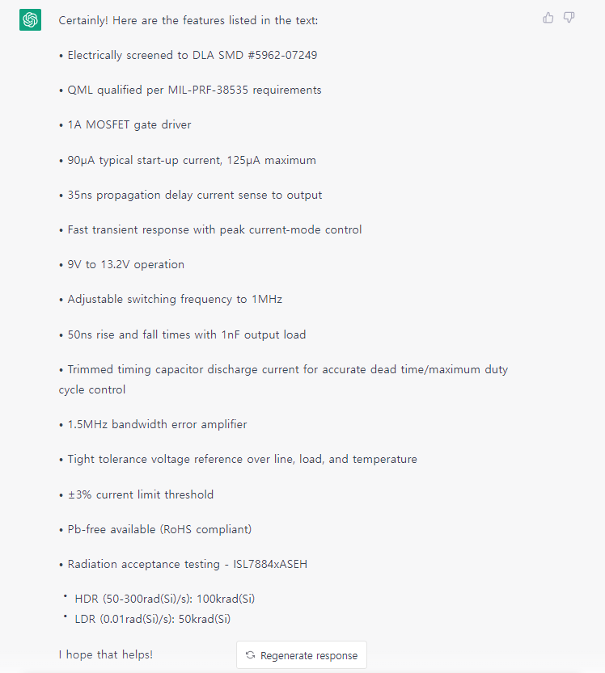
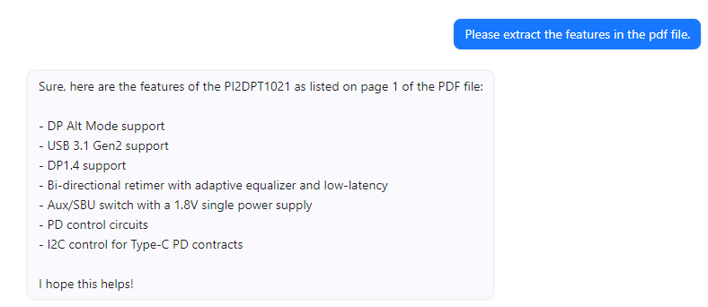

### 반도체 특화 chatbot 생성 가능성
1. GPT 는 기본적으로 언어 생성 모델이기 때문에 Datasheet 의 정확한 문장을 들고 오지 않는다. 
 - ex) features를 모두 추출해달라고 지시했음을 가정, pdf내의 줄 간격이 조금이라도 떨어지면 제일 아래쪽의 두 줄은 가져오지 않는 모습
 
<br><br>
2. ChatPDF의 PDF 인식은 이미지화된 글자를 인식하지 못한다.
 - ex) 
 

3. API 를 활용했을 경우, 막대한 비용 발생
- 현재 운영중인 alldatasheet의 이용자수를 비교해서 생각해봤을 때 생각되는 그 비용은 막대하다.
```
< 하루 100명 / 한명당 100번 대화 >
GPT-3 : 한달 2,100,000원
Dialogflow : 한달 720,000원
카카오i 오픈빌더 : 무료

< 하루 1,000명 / 한명당 100번 대화 >
GPT-3 : 한달 21,000,000원
Dialogflow : 한달 7,200,000원
카카오i 오픈빌더 : 무료

< 하루 10,000명 / 한명당 100번 대화 >
GPT-3 : 한달 210,000,000원
Dialogflow : 한달 72,000,000원
카카오i 오픈빌더 : 한달 7,500,000원

< 하루 100,000명 / 한명당 100번 대화 >
GPT-3 : 한달 2,100,000,000원
Dialogflow : 한달 720,000,000원
카카오i 오픈빌더 : 한달 88,500,000원
```